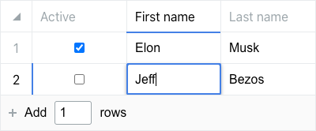

# react-datasheet-grid

[](https://www.npmjs.com/package/react-datasheet-grid)

[](https://standardjs.com)

View [demo and documentation](https://react-datasheet-grid.netlify.app/)

An Airtable-like / Excel-like component to create beautiful spreadsheets.



Feature rich:
- Dead simple to set up and to use
- Supports copy / pasting to and from Excel, Google-sheet...
- Keyboard navigation and shortcuts fully-supported
- Supports right clicking and custom context menu
- Supports custom widgets
- Blazing fast, optimized for speed
- Smooth animations
- Virtualized, supports hundreds of thousands of rows
- Extensively customizable, controllable behaviors
- Built with Typescript

## Install

```bash
npm i react-datasheet-grid
```

## Usage

```tsx
import {
  DataSheetGrid,
  checkboxColumn,
  textColumn,
  keyColumn,
} from 'react-datasheet-grid'

const Example = () => {
  const [ data, setData ] = useState([
    { active: true, firstName: 'Elon', lastName: 'Musk' },
    { active: false, firstName: 'Jeff', lastName: 'Bezos' },
  ])

  const columns = [
    {
      ...keyColumn('active', checkboxColumn),
      title: 'Active',
    },
    {
      ...keyColumn('firstName', textColumn),
      title: 'First name',
    },
    {
      ...keyColumn('lastName', textColumn),
      title: 'Last name',
    },
  ]

  return (
    <DataSheetGrid
      data={data}
      onChange={setData}
      columns={columns}
    />
  )
}
```
